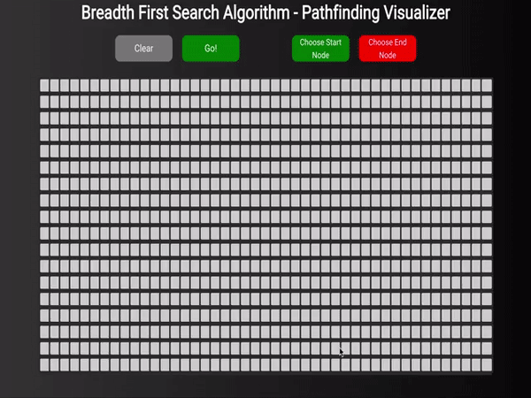

# Breadth First Search Pathfinding Visualizer
A web application that finds and animates the shortest path between two nodes.

## Directions

* Click "Choose Start Node", then click anywhere on the grid to create the starting point.
* Click "Choose End Node", then click anywhere on the grid to create the finish point.
* Click and drag to create walls (obstacles). Once an obstacle is created, it can be re-clicked to be removed.
* "Go" will start the animation process.

## Getting Started

* cd my-app
* npm run start
* Go to http://localhost:3000/

## Built With

* [React](https://reactjs.org/) - UI
* [JavaScript](https://www.javascript.com/)

## View Live Site
[Visit Here](https://condescending-thompson-2c477a.netlify.com/)

# Demo

